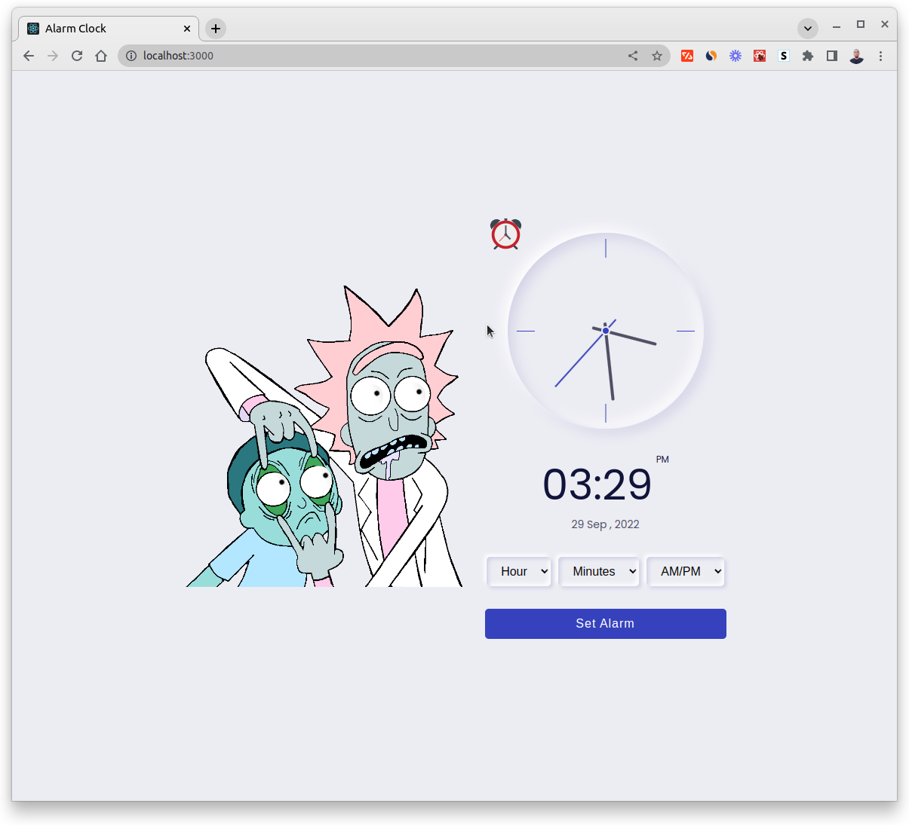
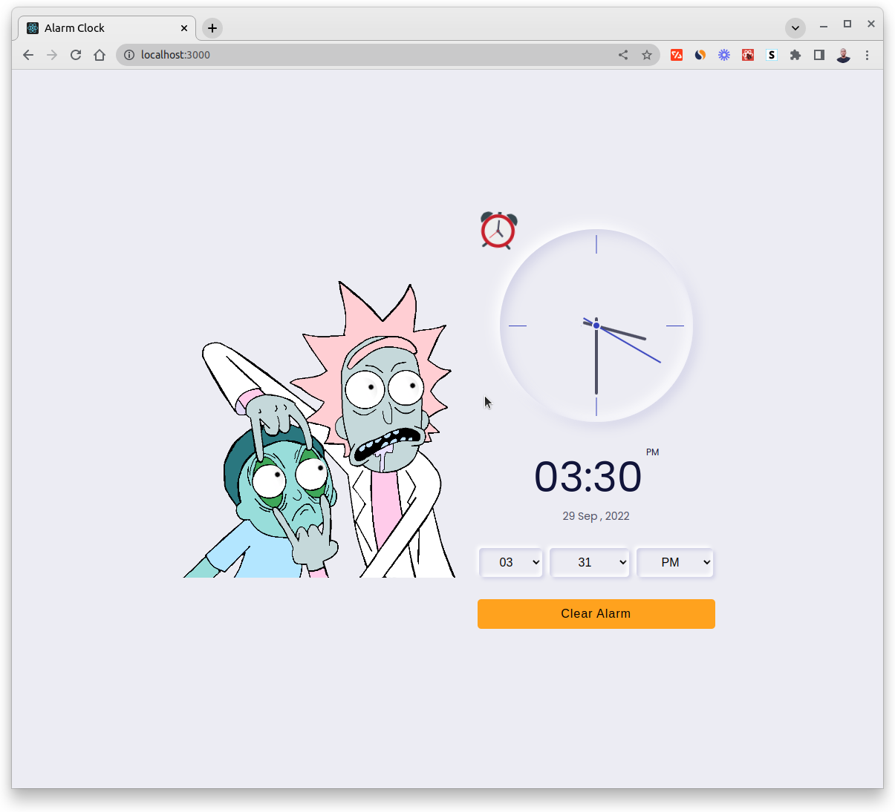

# Alarm Clock in React

[](https://digitalalarmclockinreact.netlify.app/)

[](https://digitalalarmclockinreact.netlify.app/)

## Technologies

- React
- React Context
- CSS

### Package in Project:

- React Icons

### Feature

- Analog Clock
- Digital Clock
- Date "day--Year--Month"
- Set Alarm
- Eyes moving on `mousemove` event

## How to run

Please follow the below instructions to run this project in your machine:

1. Clone this repository
   ```sh
   git clone https://github.com/mdtanvirahamedshanto/Alarm-Clock-in-React
   ```
2. Navigate the directory
   ```sh
   cd alarm-clock
   ```
3. Install dev dependencies
   ```sh
   yarn
   ```
4. Run the app
   ```sh
   yarn start
   ```
